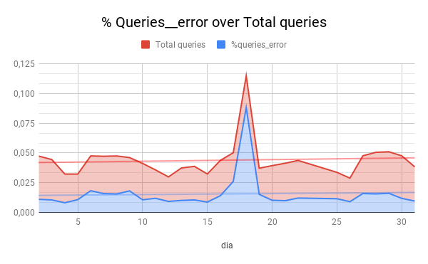
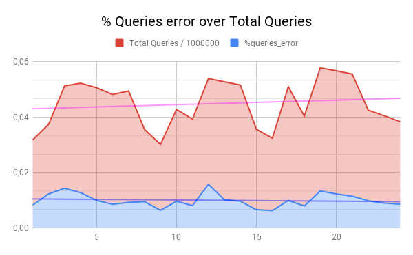

Assignment: Decision making
===========================

## Task

* Clients complain that the searches for a destinations sometimes fail. Head of product decided to address the issue, and ask development team to work on fix.
* The team committed to work out the solution during August. It was agreed that the team’s bonus payout would depend on effectiveness of the solution.
* The Head of Product ask you to analyze the data and help him to decide whether the team deserve the bonus?
* Your answer should be documented and submitted to the **GitHub** so that any changes can be easily tracked.

### Getting the data

We use aws tool to log into bdatainsittue amazon web services account and get the data to analyze:

```
(base) air-de-jose:01_TechCrashCourse jose$ pwd
/Users/jose/bdataInst/01_TechCrashCourse
(base) air-de-jose:01_TechCrashCourse jose$ aws s3 ls s3://data.public.bdatainstitute.com/dam  --recursive --human-readable
2019-03-28 15:24:39    0 Bytes dam/
2019-03-28 15:25:03  272.0 KiB dam/query_logs/2018/08/2018_08_18452212_log.json
2019-03-28 15:25:03  138 Bytes dam/query_logs/2018/08/2018_08_18452212_summary.json
2019-03-28 15:25:03  227.5 KiB dam/query_logs/2018/09/2018_09_18452212_log.json
2019-03-28 15:25:03  133 Bytes dam/query_logs/2018/09/2018_09_18452212_summary.json
(base) air-de-jose:01_TechCrashCourse jose$ 
(base) air-de-jose:01_TechCrashCourse jose$ aws s3 cp s3://data.public.bdatainstitute.com/dam/ . --recursive
download: s3://data.public.bdatainstitute.com/dam/query_logs/2018/09/2018_09_18452212_summary.json to query_logs/2018/09/2018_09_18452212_summary.json
download: s3://data.public.bdatainstitute.com/dam/query_logs/2018/08/2018_08_18452212_summary.json to query_logs/2018/08/2018_08_18452212_summary.json
download: s3://data.public.bdatainstitute.com/dam/query_logs/2018/09/2018_09_18452212_log.json to query_logs/2018/09/2018_09_18452212_log.json
download: s3://data.public.bdatainstitute.com/dam/query_logs/2018/08/2018_08_18452212_log.json to query_logs/2018/08/2018_08_18452212_log.json
(base) air-de-jose:01_TechCrashCourse jose$ 
```

As we can see, logs are in __json__ format.  
The flightplan is:  

1. Convert json format to csv or excel format. 
2. Bring the data to Google Spreadsheet. 
3. Analyze the data. 

### Tools used
* [aws](https://aws.amazon.com/cli/)
* [Git] (https://git-scm.com/)
* [Json to csv](http://www.convertcsv.com/json-to-csv.htm)
* [Google Spreadsheet](https://www.google.com/sheets/about/)


## Analysis
### logs agosto 2018
* Los días 1, 23 y 24 están incompletos. Faltan horas. 
* El día 18 se aprecia un comportamiento anómalo. Hay un factor 10 de diferencia en el nivel de query_error de 11:00 a 16:00. Posiblemente mal funcionamiento de un server.
*  Las últimas líneas del log corresponden al día 1 de septiembre. Las retiraremos y las añadiremos al log de septiembre.

### Logs septiembre 2018
* A partir del día 24 no hay logs


### Análisis

1. Descartamos los días 1, 23 y 24 de agosoto al no estar completos y efectuamos el análisis mediante tablas dinámicas.
2. Nos interesa saber el porcentaje de errores sobre el total de queries y su evolución durante el mes.
2. Proyectamos el porcentaje junto al número total de queries dividido por 1000000 para poder visualizarlos en un mismo rango de valores.

___

#### agosto

___

#### septiembre



### Conclusión 

En el cálculo del porcentaje global de errores pasamos de **0,015** en agosto a **0,010** en septiembre. Sin embargo es en las líneas de tendencia donde mejor se refleja las mejoras introducidas. Pasamos de una leve tendencia al alza en agosto a un mantenimiento constante del porcentaje de error en septiembre. Incluso con un número total de queries en alza.

